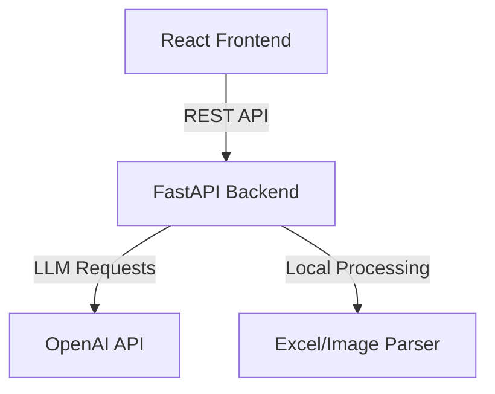

# Architecture Overview - QA-Assistant

This document describes the architectural design and file structure of the **QA-Assistant** project.

## Components

QA-Assistant is structured as a decoupled monorepo containing a FastAPI backend and a React + Vite + TypeScript frontend.



### 1. Backend (Python + FastAPI)
The backend provides stateless API endpoints to drive the stage-based flow. It does not persist sessions to a database for maximum flexibility; instead, state is passed back and forth between the client and server or kept in standard session models.

Key modules:
-   **API Endpoints (`app/api/`)**: Handlers for requirements processing, matrix modification, question handling, scenario generation, and comparing scenario revisions.
-   **LLM Service (`app/services/llm_service.py`)**: Interacts with the OpenAI API using structured prompts designed for QA analysis.
-   **Parser Service (`app/services/parser.py`)**: Responsible for handling attachment files (excel/image mock parsers).

### 2. Frontend (React + Vite + TypeScript)
The frontend is a single-page application (SPA) built using React. It manages the user flow across either 5 stages (New Design) or 6 stages (Existing Design modification).

Key elements:
-   **Design System (`src/index.css`)**: Implements a dark glassmorphic layout using vanilla CSS.
-   **Global State (`src/context/DesignContext.tsx`)**: Manages the user's active session, including requirements, the current matrix, questions, scenarios, and comparisons.
-   **Stage Views (`src/views/`)**: Separate UI dashboards for each of the stage flows, keeping stage logic self-contained.

## Data Schema & Communication

The backend relies on Pydantic models to validate inputs and outputs at each stage. Since state is client-driven:
1.  **Stage 1 -> Stage 2**: User uploads requirements. The backend returns a list of parsed requirements with unique IDs (e.g., `RQ-01`, `RQ-02`).
2.  **Stage 2 -> Stage 3**: User edits the requirement list. On submit, the backend passes the finalized requirements to the LLM to generate clarifying questions.
3.  **Stage 3 -> Stage 4**: User answers or skips questions. Once completed, requirements + answers are sent to the backend. The LLM generates test scenarios matching the requested format:
    ```
    TC-###: [Name] - [Priority]
    Preconditions: ...
    Steps: ...
    Expected Result: ...
    Coverage: ...
    ```
4.  **Stage 4 -> Stage 5 (Existing) / Stage 5 (New)**:
    -   In **New Design** mode, the backend maps test cases back to requirements to compile the final Traceability Matrix (Stage 5).
    -   In **Existing Design** mode, the backend first compares the new test cases with the old ones (provided in Stage 1) to generate a comparison delta (Stage 5), and then outputs the final matrix & scenarios (Stage 6).
