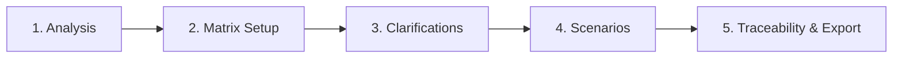
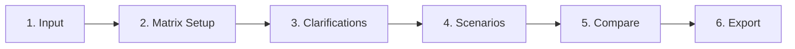

# QA-Assistant Stages & Workflows

QA-Assistant helps users run a highly structured, AI-assisted test design process. The workflow depends on the selected mode.

---

## Mode 1: New Test Design (5 Stages)

### Stage 1: Analysis & Requirements Input
-   **User Action**: Enters raw requirements (text), additional comments, and uploads attachments (images of wireframes, Excel spreadsheets).
-   **System Action**: Parses requirements and parses attachments.
-   **Transition**: Click "Next" to generate the initial traceability matrix rows.

### Stage 2: Traceability Matrix Setup
-   **User Action**: Reviews generated requirements. Can add new rows, edit existing rows, or delete rows.
-   **System Action**: Displays the first 2 columns: ID (e.g. `RQ-01`) and the Requirement description. Tracks the number of test cases (initialized to 0).
-   **Transition**: Click "Next" to generate clarifying questions based on the requirements.

### Stage 3: Clarifying Questions
-   **User Action**: The user must address clarifying questions generated by the OpenAI LLM.
    -   Can write an answer and submit.
    -   Can click "Skip" which moves the current question to the end of the queue.
-   **System Action**: Evaluates requirements and highlights ambiguous parts. Keeps a queue of questions.
-   **Transition**: Once all questions are answered or skipped, click "Start Test Analysis" to generate test scenarios.

### Stage 4: Test Scenario Generation
-   **User Action**: Reviews generated test scenarios. Can:
    -   Edit existing test scenarios (preconditions, steps, expected results, priorities, coverage).
    -   Delete test scenarios.
    -   Add new custom test scenarios.
-   **System Action**: OpenAI LLM generates test scenarios based on the requirements and the answers to the clarifying questions. Scenarios must have the standard layout (TC-###, Preconditions, Steps, Expected Result, Coverage).
-   **Transition**: Click "Next" to compile final results.

### Stage 5: Traceability & Export
-   **User Action**: View the finalized Traceability Matrix and copy/export test scenarios.
-   **System Action**: Renders the complete Traceability Matrix mapping Requirements (rows) to Test Scenarios (columns), marked with `+` or `-` for coverage, and calculates total coverage count per requirement. Displays formatted, easy-to-copy Markdown test scenarios.

---

## Mode 2: Existing Test Design Refinement (6 Stages)

### Stage 1: Input Requirements & Existing Tests
-   **User Action**: Enters new requirements, comments, uploads attachments, and copies/pastes existing test scenarios (old test cases).
-   **Transition**: Click "Next" to parse inputs.

### Stage 2: Matrix Setup
-   **User Action**: Identical to Mode 1 Stage 2. User confirms the list of requirements.

### Stage 3: Clarifying Questions
-   **User Action**: Identical to Mode 1 Stage 3. User resolves ambiguities.

### Stage 4: Test Scenario Generation
-   **User Action**: Identical to Mode 1 Stage 4. System generates updated test scenarios.

### Stage 5: Comparison
-   **User Action**: Reviews the differences.
-   **System Action**: OpenAI LLM compares the old test scenarios (from Stage 1) with the new/modified test scenarios (from Stage 4). Generates a diff/summary highlighting:
    -   New test scenarios added.
    -   Obsolete test scenarios removed/updated.
    -   Modified steps or coverage mappings.

### Stage 6: Traceability & Export
-   **User Action**: Views and copies the final matrix and test scenarios. Also displays the change report/summary from Stage 5.
